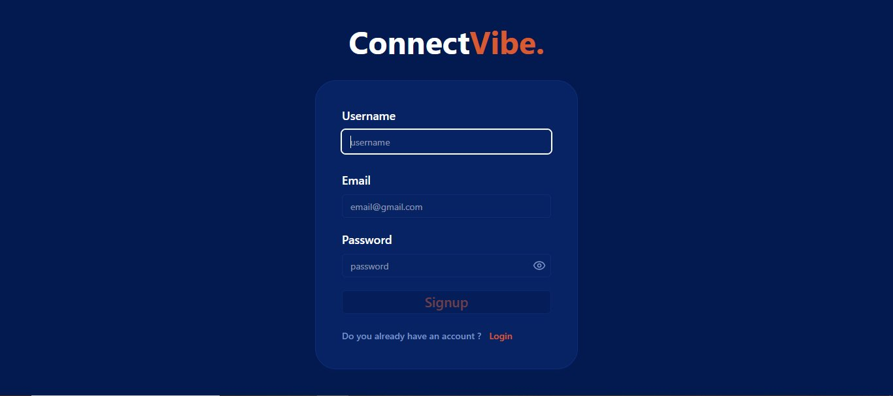
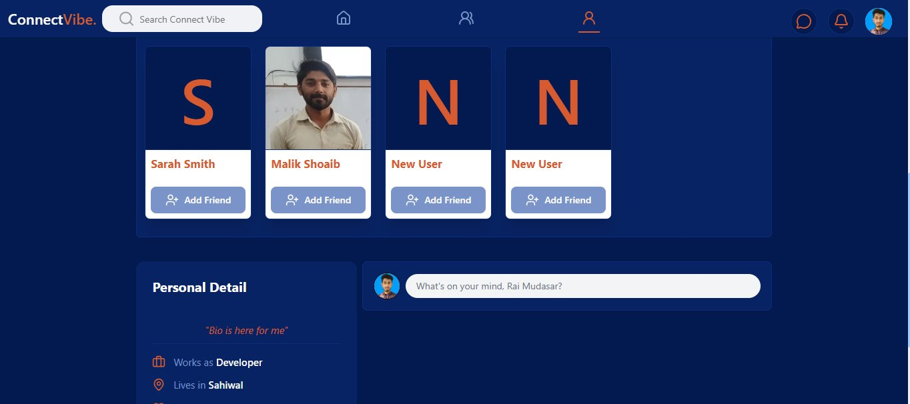
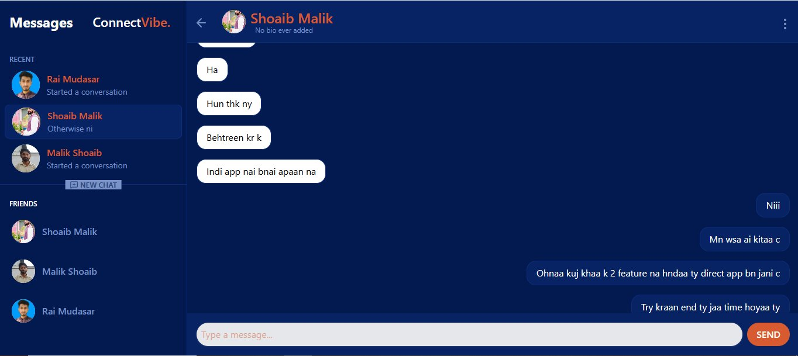
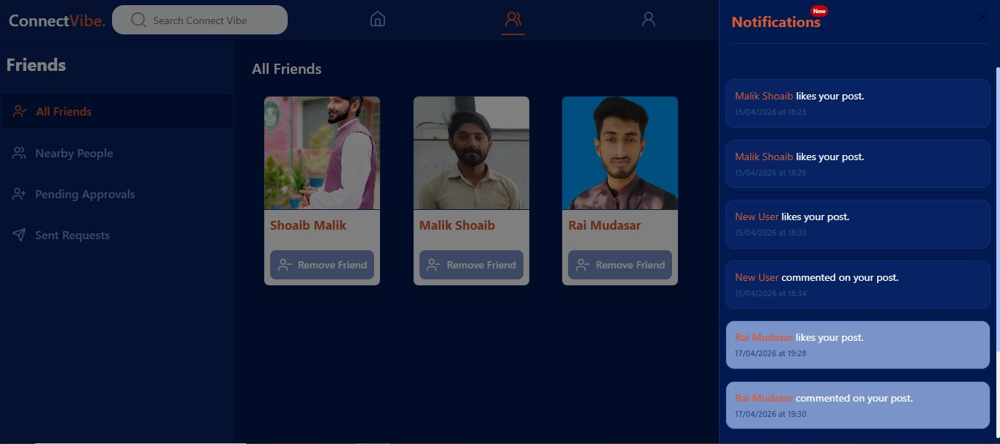
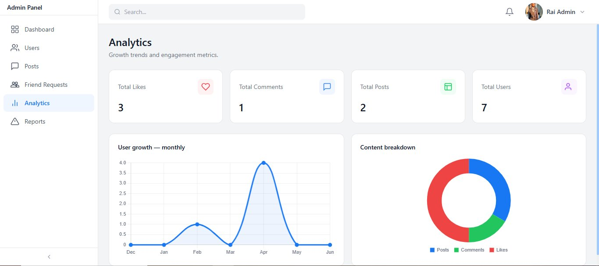

# ConnectVibe

**A full-stack social media platform built with Next.js, MongoDB, and Pusher.**

[](https://connectvibe.vercel.app)
[](https://nextjs.org)
[](https://mongodb.com)
[](https://pusher.com)

---

## Overview

ConnectVibe is a feature-rich Facebook clone engineered with modern web technologies. It delivers a fast, responsive, and dynamic user experience — combining robust authentication, real-time messaging, interactive post feeds, dynamic user profiles, and a full administration panel.

---

## Screenshots

### Authentication

> Clean signup flow with username, email, and password — validated via React Hook Form + Zod.



---

### Home Feed

> Personalised news feed with friend suggestions, post composer, and personal detail sidebar.



---

### Real-Time Messaging

> Live chat powered by Pusher WebSockets — full conversation threads with recent chats and friends list.



---

### Friends & Notifications

> Friend management with All Friends, Nearby People, Pending Approvals, and Sent Requests — plus a live notification panel showing likes and comments in real time.



---

### Admin Panel — Analytics

> Full admin dashboard with engagement metrics (likes, comments, posts, users), monthly user growth chart, and content breakdown donut chart.



---

## Features

| Feature | Description |
| :--- | :--- |
| 🔒 **Secure Authentication** | Email/Username login via NextAuth.js Credentials provider, validated with React Hook Form + Zod |
| 💬 **Real-Time Messaging** | Live chat powered by Pusher WebSockets with — no mobile keyboard overlap bugs |
| 📰 **Interactive Feed** | Infinite scroll news feed with `useMemo`-optimised rendering to prevent redundant re-renders |
| 👥 **Social Graph** | Follow/Unfollow system using atomic MongoDB aggregators (`$pull`, `$inc`) |
| 🔔 **Live Notifications** | Real-time like and comment alerts with a notification panel and unread badge |
| 🛡️ **Admin Panel** | Full dashboard with analytics charts, user management, bulk delete via `deleteMany`, and ban toggles |
| 🎨 **UI System** | Shadcn/UI components on Tailwind CSS with Lucide React icons and custom global scrollbars |

---

## Tech Stack

| Layer | Technology |
| :--- | :--- |
| **Framework** | Next.js (App Router) |
| **State & Cache** | `useState`, `useDebounce`, TanStack Query (React Query) |
| **Forms & Validation** | React Hook Form + Zod Schema Validation |
| **Database** | MongoDB via Mongoose ODM |
| **Real-Time** | Pusher Channels WebSocket Integration |
| **Styling** | Tailwind CSS + Shadcn/UI + Lucide React |

---

## Getting Started

### Prerequisites

- Node.js `v18+`
- `npm` or `pnpm`

### 1. Clone the Repository

```bash
git clone https://github.com/rai-mudasar/connect_vibe.git
cd connect_vibe
```

### 2. Configure Environment Variables

Create a `.env` file in the project root:

```env
# App & Database
MONGODB_URI=mongodb+srv://<username>:<password>@cluster.mongodb.net/connectvibe
NEXTAUTH_SECRET=your_nextauth_secret
NEXTAUTH_URL=http://localhost:3000

EMAIL_USER = your_mailing_user
EMAIL_PASS = your_mail_pass

# Cloudinary Data : 
NEXT_PUBLIC_CLOUDINARY_CLOUD_NAME = your_cloudinary_name
CLOUDINARY_API_SECRET = your_cloudinary_secret
CLOUDINARY_API_KEY = your_api_key

# Pusher WebSockets
NEXT_PUBLIC_PUSHER_KEY=your_pusher_public_key
PUSHER_APP_ID=your_pusher_app_id
PUSHER_SECRET=your_pusher_secret
PUSHER_CLUSTER=your_pusher_cluster
```

### 3. Install & Run

```bash
npm install
npm run dev
```

Open [http://localhost:3000](http://localhost:3000) in your browser.

---

## Project Structure

```
connectvibe/
├── app/                  # Next.js App Router pages & API routes
├── components/           # Reusable UI components (Shadcn/UI based)
├── lib/                  # MongoDB connection, auth config, utilities
├── models/               # Mongoose schemas (User, Post, Message, etc.)
├── hooks/                # Custom React hooks (useDebounce patterns)
└── public/screenshots/   # App preview images
```

---

## License

MIT © [Mudasar Imran](https://github.com/rai-mudasar)
